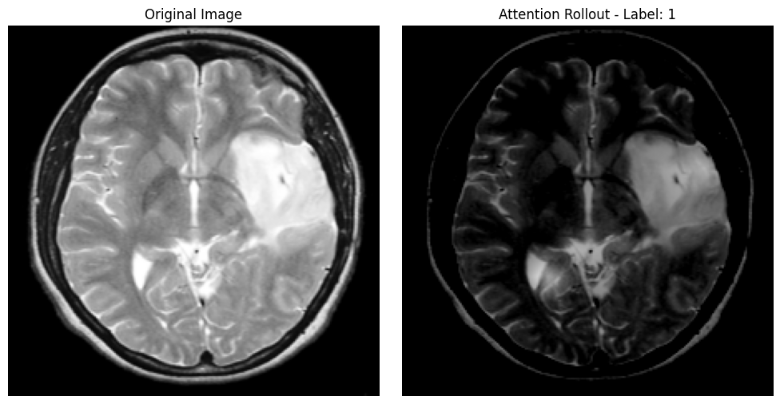
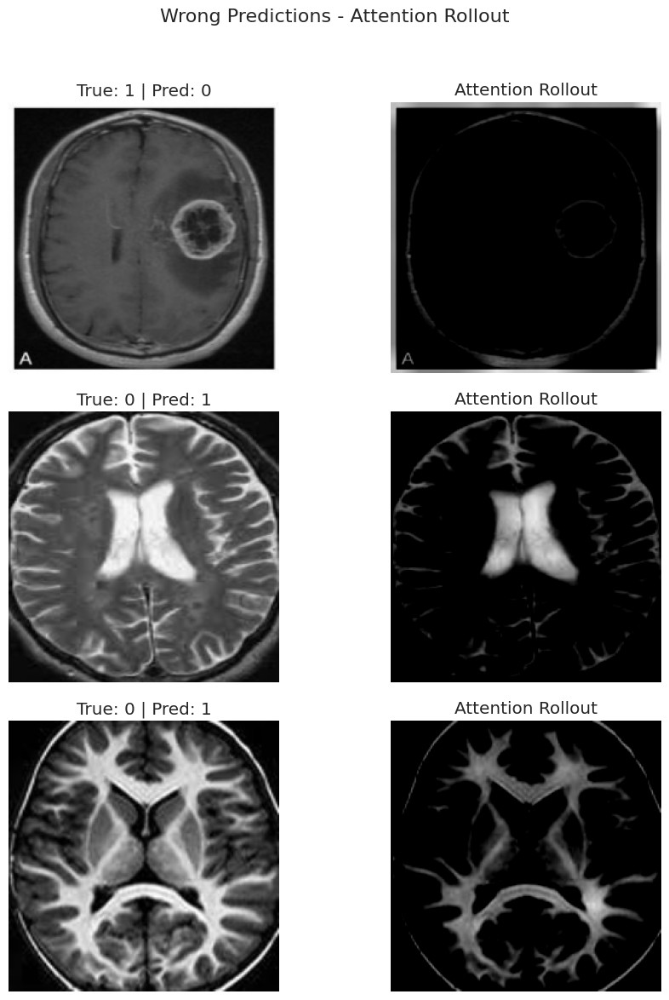
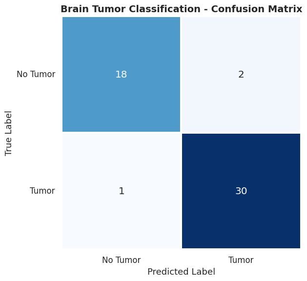

# 🧠 Brain Tumor Classification with Vision Transformers

This repository contains an implementation of a Vision Transformer (ViT) model for classifying presence of a tumor in brain MRI scans. The model achieves an **F1-score of 0.94**, with interpretability powered by **Attention Rollout**.

## 🚀 Highlights

- 📊 **High Accuracy**: Achieved 0.94 F1-score on the test set.
- 🔍 **Explainability**: Integrated attention rollout visualizations for interpretability.
- 🧠 **Medical Imaging**: Used transformer architecture for brain MRI classification.
  
---

# 💾 Data Source

Kaggle: Brain MRI Images for Brain Tumor Detection ![https://www.kaggle.com/datasets/navoneel/brain-mri-images-for-brain-tumor-detection]

---

## 🧠 Model Overview

The model `vit_base_patch16_224` has been fine-tuned to handle small-scale medical data using transfer learning and regularization techniques.

### 📌 Task

- **Binary Classification**:
  - **Class 0**: No Tumor
  - **Class 1**: Tumor

---

## 📸 Visualization

### ✅ Correct Prediction with Attention


The attention map highlights regions critical to the model's prediction. Notice how the tumor region is sharply attended to.

---

### ❌ Misclassifications and Their Attention Maps


Even in incorrect predictions, the attention maps show where the model focused—often highlighting semantically relevant but misleading regions.

---

### 📊 Confusion Matrix


- **True Positives (TP)**: 30
- **True Negatives (TN)**: 18
- **False Positives (FP)**: 2
- **False Negatives (FN)**: 1

---

## 🧪 Metrics

| Metric       | Score  |
|--------------|--------|
| Accuracy     | 0.96   |
| Precision    | 0.94   |
| Recall       | 0.97   |
| **F1-score** | **0.94** |

---

## 🛠️ How to Run

1. Clone the repository:
   ```bash
   git clone https://github.com/blisssome/brain-tumor-classification.git
   cd brain-tumor-classification
   ```

2. Open the notebook:
   ```bash
   jupyter notebook brain_tumor.ipynb
   ```

3. Install required dependencies (if not already):
   ```bash
   pip install -r requirements.txt
   ```

---

## 💡 Future Work

- Multi-class classification (e.g., glioma, meningioma, pituitary)
- Model compression for edge deployment

---

## 🧑‍🔬 Author

**Emil Aliyev**  
Graduate student in AI & Data Science (MSc)  
Special interests: cognitive science, EEG signals, BCI, interpretability, neurosymbolic AI, reinforcement learning, game development
